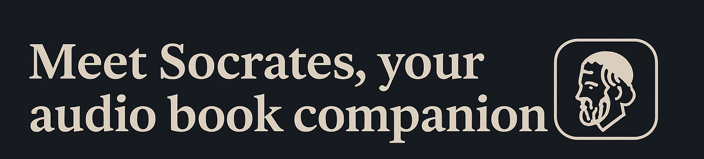

You’re on the go 🚗🚴‍♀️🚶‍♂️ — in your car, on a bike, on a walk.  
You want to learn about something 📚, you open conversational ChatGPT, but every answer is shallow, tells you things you already know.  
You want to go in depth 🔍, but ChatGPT keeps giving you 30-second answers that stay on the surface.

Meet **Socrates** 🎧 — your audiobook companion that combines the flexibility of LLMs with the depth and structure of audiobooks and audio content.  
This is the future of conversational and audio learning, where you will be able to:

- **Ask to learn about a topic** and it will find the right chapter for you 🎯.  
- **Missed a piece of the logic** that’s hard to grasp in audio? Ask Socrates to explain the last idea 💡 and he will answer by voice and writing.  
- **You know what you want to master** — Infrastructure, Fundraising, Selling… but not the exact next topic? Socrates will play chapters to fill the gaps in your knowledge.

Socrates will be there at your phone’s reach 📱, to explore whatever you need to build your next big thing.

---

**This all starts here.** ✨
